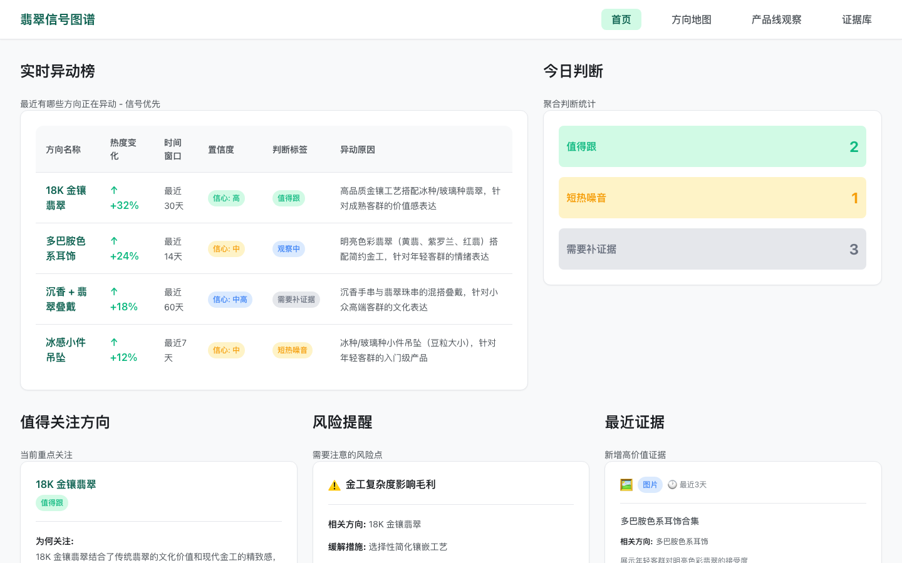
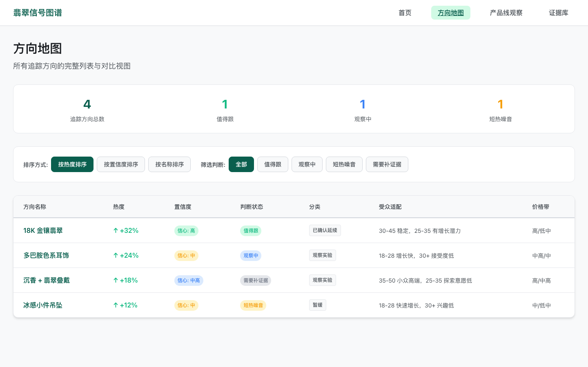
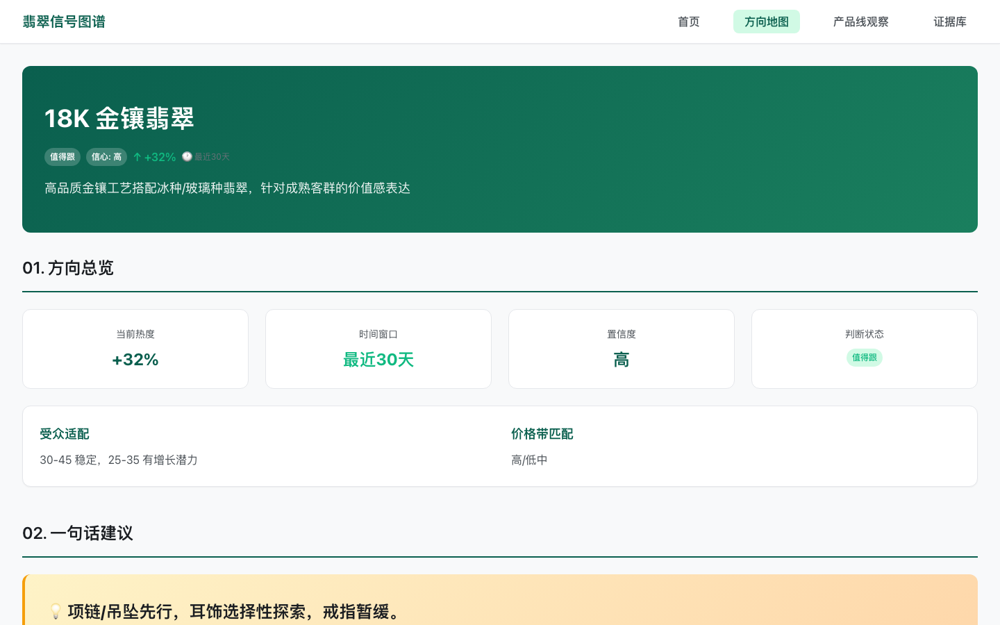
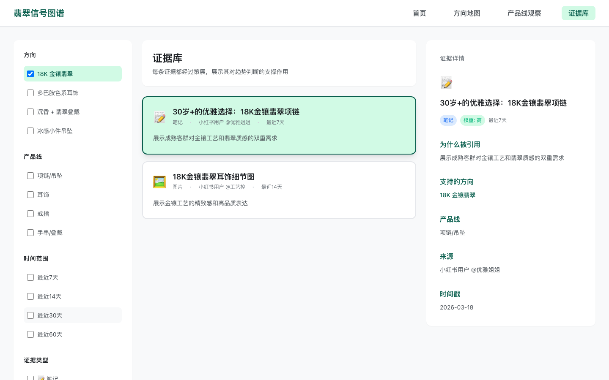

<div align="center">

# intelligence

**把中文社交平台采集的原始内容转化为结构化趋势信号、方向聚类和决策报告**

[](https://python.org)
[](pyproject.toml)
[](tests/)
[](LICENSE)

</div>

---

```
in  JSONL 文件（MediaCrawler / 小红书下载器 / 抖音下载器导出）
out 7 个文件：normalized_samples.json, scored_samples.json, dashboard.json,
    frontend_dashboard.json, report.json, report.md, report.html
    + 5 页交互式静态看板（dashboard/）

fail 输入文件不存在          → exit 1, stderr 提示路径
fail JSONL 行格式不合法      → 跳过该行，继续处理
fail Pack 名称未注册         → exit 1, stderr 提示可用 pack
fail Pack 资产校验失败       → exit 1, 列出缺失/非法项
fail 输入样本为空            → 生成空报告（不崩溃）
```

## 示例输出

运行 `python3 -m intelligence run-pack jade --output-dir output/jade` 后，`report.md` 输出：

```markdown
# Jade Pack Report

Jade pack processed 1 MediaCrawler sample from mediacrawler_jade_export.jsonl
and produced a compact research report. The top signal scored 0.80 with high confidence.

## Trend Clusters

### Jade Pendant Signal
- weighted score: 0.80
- confidence: high
- classification: confirmed_continuation
- category-specific cue: jade + pendant language

## Product Priorities

### Build Now
- direction: jade pendant feature line
- why: the fixture shows a clear, repeatable category cue
```

`scored_samples.json` 输出（单条样本）：

```json
{
  "bucket_scores": {
    "jade_signal": 1.0,
    "modernity": 0.5,
    "commerce": 0.7
  },
  "weighted_score": 0.8,
  "confidence": "high",
  "classification": "confirmed_continuation"
}
```

看板截图（5 页静态 HTML，中文界面）：

<p align="center">
  
  
</p>
<p align="center">
  
  
</p>

## 架构

```
JSONL (多平台导出)
  │
  ▼
┌──────────┐    ┌────────────────┐    ┌─────────────────┐
│ Adapters │───▶│ ScoringEngine  │───▶│ DirectionCluster│
│ 归一化   │    │ 70%关键词      │    │ 趋势方向聚类    │
│          │    │ 30%互动量      │    │                 │
└──────────┘    └────────────────┘    └────────┬────────┘
                                               │
                          ┌────────────────────┤
                          ▼                    ▼
                   ┌────────────┐     ┌──────────────┐
                   │ Reports    │     │ Dashboard    │
                   │ JSON/MD/   │     │ 5页静态HTML  │
                   │ HTML       │     │ 中文界面     │
                   └────────────┘     └──────────────┘
```

品类研究逻辑通过 **Project Pack** 机制隔离 — 引擎通用，配置专属。

## 快速开始

```bash
# 克隆
git clone https://github.com/zinan92/intelligence.git
cd intelligence

# 安装（可选，零外部依赖）
pip install -e .

# 运行内置翡翠示例
python3 -m intelligence run-pack jade --output-dir output/jade

# 运行潮牌示例（指定输入文件）
python3 -m intelligence run-pack designer_streetwear \
  --input examples/designer_streetwear/real_pilot/streetwear_collected.jsonl \
  --output-dir output/streetwear

# 启动看板
python3 -m http.server 8765 --directory dashboard
# 浏览器打开 http://localhost:8765/
```

## 功能一览

| 功能 | 说明 |
|------|------|
| 多源归一化 | MediaCrawler / 抖音 / 小红书三种导出格式 → `CanonicalSample` |
| 加权评分引擎 | 70% 关键词匹配 + 30% 互动量（点赞、收藏、评论、分享） |
| 趋势方向聚类 | 高分信号自动聚类为趋势方向（Direction） |
| 多格式报告 | 同时输出 JSON / Markdown / HTML 三种报告 |
| 交互式看板 | 5 页静态 HTML 看板，中文界面，内联 SVG 图表 |
| Project Pack | 品类配置隔离 — 种子关键词 + YAML 配置即可定义新品类 |
| 零依赖 | 仅使用 Python 标准库，frozen dataclass 保证不可变 |

## 技术栈

| 层级 | 技术 | 用途 |
|------|------|------|
| 语言 | Python 3.10+ | 核心运行时 |
| 数据模型 | `dataclasses` (frozen, slots) | 不可变 canonical schema |
| 序列化 | 标准库 `json` | JSONL 读取 / JSON 输出 |
| 模板 | `string.Template` | HTML 报告渲染 |
| 构建 | 自定义 PEP 517 build backend | 零外部依赖打包 |
| 前端 | 原生 HTML / CSS / JS | 5 页静态看板，内联 SVG 图表 |
| 测试 | pytest | 138 tests |

**零外部运行时依赖** — 仅使用 Python 标准库。测试时需要 `pytest`。

## 项目结构

```
intelligence/
├── src/intelligence/
│   ├── adapters/              # XHS / Douyin / MediaCrawler 归一化器
│   │   ├── mediacrawler.py
│   │   ├── xhs_downloader.py
│   │   └── douyin_downloader.py
│   ├── scoring/               # 加权评分引擎
│   │   ├── engine.py          # ScoringEngine + ScoringConfig
│   │   └── engagement_buckets.py
│   ├── analysis/              # 聚类 + 前端数据构建
│   │   ├── direction_clustering.py
│   │   └── frontend_builder.py
│   ├── workflows/             # Pipeline 编排
│   │   ├── pack_runner.py     # 通用 run-pack 流程
│   │   ├── jade_pack.py       # 翡翠 PackSpec
│   │   └── streetwear_pack.py # 潮牌 PackSpec
│   ├── reporting/             # 报告生成（JSON / MD / HTML）
│   ├── schema/                # Canonical 数据模型
│   │   └── canonical.py       # CanonicalSample 及子结构
│   ├── projects/              # Pack 定义
│   │   ├── jade/              # 翡翠趋势 pack
│   │   └── designer_streetwear/ # 潮牌街头 pack
│   ├── cli.py                 # CLI 入口
│   └── __main__.py
├── dashboard/                 # 5 页静态 HTML 看板（中文）
├── tests/                     # 138 unit + integration tests
├── examples/                  # 示例输入和预生成输出
├── docs/
├── pyproject.toml
└── build_backend.py           # 自定义 PEP 517 构建后端
```

## 配置

### Project Pack 结构

```
projects/jade/
├── config/project.yaml        # 品类配置
├── keywords/seed_keywords.csv # 种子关键词
└── templates/                 # 报告模板（Markdown）
```

### project.yaml 示例

```yaml
name: jade
domain: xiaohongshu
purpose: jade_trend_research
keyword_groups:
  - jade_basics
  - modern_jade_design
  - material_combination
  - style_and_scene
  - price_and_gifting
  - adjacent_categories
```

### 评分权重

70/30 关键词-互动量权重分配。互动量分桶（`interaction_strength`、`commercial_intent`、`propagation_velocity`）从点赞、收藏、评论、分享推导。

### 已有 Pack

| Pack | 品类 | 评分分桶 |
|------|------|----------|
| `jade` | 翡翠珠宝趋势 | jade_signal, modernity, commerce, interaction_strength, commercial_intent, propagation_velocity |
| `designer_streetwear` | 潮牌街头趋势 | silhouette, graphic, layering, brand, material, commerce, interaction_strength, commercial_intent, propagation_velocity |

添加新 Pack 详见 [docs/adding-a-pack.md](docs/adding-a-pack.md)。

## CLI 命令

### `run-pack` — 运行品类研究 Pipeline

```bash
python3 -m intelligence run-pack <pack> --output-dir <dir> [--input <file.jsonl>]
```

| 参数 | 必填 | 说明 |
|------|------|------|
| `pack` | 是 | Pack 名称：`jade` 或 `designer_streetwear` |
| `--output-dir` | 是 | 输出目录路径 |
| `--input` | 否 | JSONL 输入文件路径，省略则使用内置 fixture |

### `validate-pack` — 校验品类配置

```bash
python3 -m intelligence validate-pack <pack>
```

### `--version`

```bash
python3 -m intelligence --version
```

## For AI Agents

### Capability Contract

```yaml
name: intelligence
type: cli-tool
version: 0.1.0
language: python
python_requires: ">=3.10"
dependencies: []
install: pip install -e .
health_check: python3 -m intelligence --version

capabilities:
  - 归一化 MediaCrawler/XHS/Douyin 导出为 CanonicalSample
  - 加权评分（70% keyword + 30% engagement）
  - 聚类为趋势方向
  - 生成 JSON/Markdown/HTML 报告 + 看板数据

cli:
  entrypoint: python3 -m intelligence
  commands:
    run-pack:
      args: <pack> --output-dir <dir> [--input <file.jsonl>]
      packs: [jade, designer_streetwear]
    validate-pack:
      args: <pack>

input: JSONL (MediaCrawler/XHS/Douyin export, one JSON object per line)
output:
  - normalized_samples.json
  - scored_samples.json
  - dashboard.json
  - frontend_dashboard.json
  - report.json
  - report.md
  - report.html

failure_modes:
  - input_file_missing: exit 1
  - pack_not_registered: exit 1
  - pack_validation_fail: exit 1
  - empty_input: empty report (no crash)
```

### Agent 调用示例

```bash
# CLI — 运行 pipeline 并读取结果
python3 -m intelligence run-pack jade --output-dir /tmp/intel-output
cat /tmp/intel-output/report.json
cat /tmp/intel-output/scored_samples.json
```

```python
# Python — subprocess 调用
import subprocess, json
from pathlib import Path

def run_intelligence(pack: str = "jade") -> dict:
    output_dir = Path("/tmp/intelligence-output")
    output_dir.mkdir(exist_ok=True)
    result = subprocess.run(
        ["python3", "-m", "intelligence", "run-pack", pack,
         "--output-dir", str(output_dir)],
        capture_output=True, text=True
    )
    assert result.returncode == 0, f"Pipeline failed: {result.stderr}"
    return {
        "scored": json.loads((output_dir / "scored_samples.json").read_text()),
        "report": json.loads((output_dir / "report.json").read_text()),
    }
```

```python
# Python API — 直接调用模块
from intelligence.adapters.mediacrawler import load_samples
from intelligence.scoring.engine import ScoringEngine, ScoringConfig

samples = load_samples("path/to/export.jsonl")
engine = ScoringEngine(ScoringConfig(
    bucket_weights={"signal_a": 0.6, "signal_b": 0.4},
    confidence_rules=(),
    classification_rules=(),
))
```

## 相关项目

| 项目 | 说明 | 链接 |
|------|------|------|
| MediaCrawler | 小红书/抖音等平台的采集引擎（上游数据源） | -- |
| quant-data-pipeline | 量化数据管道（同生态系统） | [GitHub](https://github.com/zinan92/quant-data-pipeline) |
| qualitative-data-pipeline | 定性数据管道（同生态系统） | [GitHub](https://github.com/zinan92/qualitative-data-pipeline) |

## License

MIT
